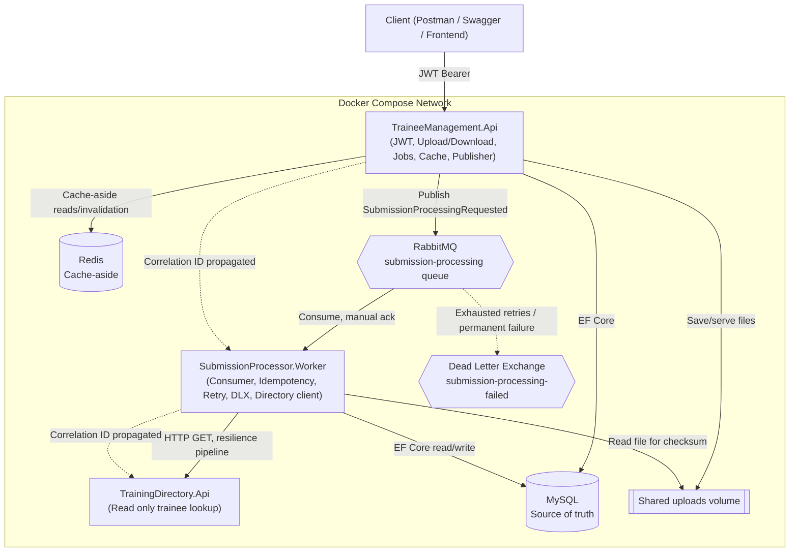

```mermaid
flowchart TB
    Client["Client (Postman / Swagger / Frontend)"]

    subgraph Docker ["Docker Compose Network"]
        API["TraineeManagement.Api<br/>(JWT, Upload/Download, Jobs, Cache, Publisher)"]
        Worker["SubmissionProcessor.Worker<br/>(Consumer, Idempotency, Retry, DLX, Directory client)"]
        Directory["TrainingDirectory.Api<br/>(Read only trainee lookup)"]
        MySQL[("MySQL<br/>Source of truth")]
        Redis[("Redis<br/>Cache-aside")]
        RabbitMQ{{"RabbitMQ<br/>submission-processing queue"}}
        DLX{{"Dead Letter Exchange<br/>submission-processing-failed"}}
        Storage[["Shared uploads volume"]]
    end

    Client -->|JWT Bearer| API
    API -->|EF Core| MySQL
    API -->|Cache-aside reads/invalidation| Redis
    API -->|Publish SubmissionProcessingRequested| RabbitMQ
    API -->|Save/serve files| Storage
    RabbitMQ -->|Consume, manual ack| Worker
    RabbitMQ -.->|Exhausted retries / permanent failure| DLX
    Worker -->|EF Core read/write| MySQL
    Worker -->|Read file for checksum| Storage
    Worker -->|HTTP GET, resilience pipeline| Directory
    API -.->|Correlation ID propagated| Worker
    Worker -.->|Correlation ID propagated| Directory
```
